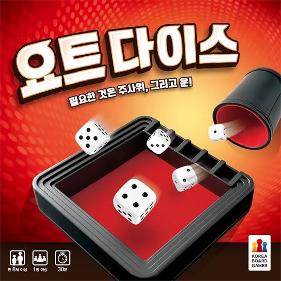
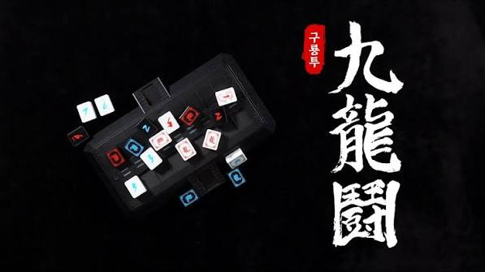
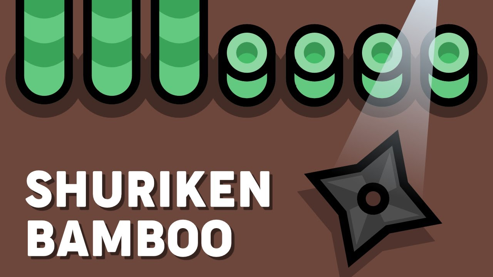

# 요트 다이스 · 구룡투 · 표창 게임

친구와 1:1로 즐기는 웹 게임. PeerJS(WebRTC P2P) 로 서버 없이 직접 연결됩니다.

## 게임

### 요트 다이스

주사위 5개를 굴려 12가지 족보를 완성하는 게임입니다. 

### 구룡투

1부터 9까지의 용을 동시에 한 장씩 내서 승부하는 게임입니다. 높은 숫자가 이기지만 1은 9를 이깁니다. 

### 표창 게임

표창을 던져 상대의 대나무 10개를 먼저 모두 자르면 승리하는 실시간 대전 게임입니다.

## 게임 방법

1. 방장이 **방 만들기** → 4자리 숫자 코드 생성
2. 친구가 코드 입력 후 **참가**
3. 방장이 게임 선택 → 시작

## 게임 실행

[https://suho31.github.io/game/](https://suho31.github.io/game/)
